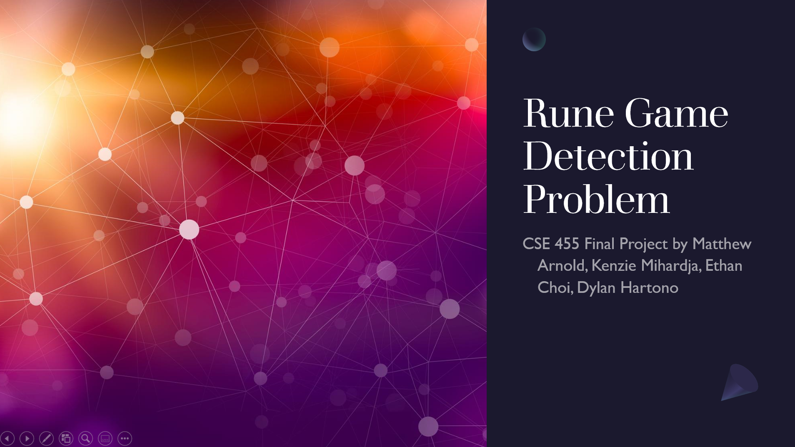

## Final Video

## The Problem

The RoboMaster robotics competition is an arena style competition where ~400 universities from
around the world build a squad of robots and compete head-to-head against each other. A major
component of this competition is a challenge called the "rune game." Your robot must hit a sequence
of plates that light up in a random order. The plates are located at a considerable distance (8m)
away and the rune game spins--initially at a constant rotational speed and then at a nonconstant
rotational speed as the match progresses. This requires that your robot can automatically detect and
aim at specific plates.

## Previous Work, Datasets, and Approach

**See the [Classical CV Approach](classical-cv.html) approach or [ML Approach](ml-approach.html).**

## Discussion

### Problems

One of the major problems that we encountered and that resulted in us starting over on the classical
CV approach was that our detection technique was too brittle. By only attempting to detect a single
feature, our detection pipeline could be easily fooled or would misdetect. The second attempt at the
problem turned out significantly better, than the first, yet there are certainly weaknesses to using
classical CV for this problem. Most notably is that parameters tuned in our testing setup will not
transfer well to the real competition. This can be solved by testing the rune game detector in real
life on a platform that is as close to the competition as possible. While a classical CV approach
does not have great transferability, it is unlikely that ML approaches that are overtrained on a
dataset will work well on a dataset the model has not encountered before.

Another more fundamental problem we encountered was that quantitatively comparing the results of
classical and ML detection algorithms is non-obvious. Much of our comparisons were performed
qualitatively, which isn't unreasonable for this particular detection problem, but it would be
optimal to be able to directly compare the classification results of both algorithms since this
would be much faster than comparing individual frames by hand. The main blocking issue was that the
classical algorithm was written in C++ and the ML one in Python. While we could add OpenCV bindings
to our C++ code (see next steps), a workaround we found was to save detection locations for each
frames and then compute the mean squared error between the labeled rune game detections and from
what the rune game outputs from the model. Using this we could better compare the accuracy of each
algorithm.

### Next Steps

There are a lot of improvements and future work we would like to do on this project. First off, we
would like to run the rune game detectors we have developed on a real rune game instead of just
using images from previous competitions. This will allow us to find more weaknesses in the detectors
and will help us better tune them.

One problem we did not address is the affect of motion blur on detection. As the camera moves
rapidly, the geometry of the rune changes significantly causing both of the detectors to lose
detection for a short period. We believe we can add post-processing logic after the detector to
handle these misdetections. This would involve adding object permanence to the detected rune game
features in the form of Kalman filtering or even more basic logic (for example, if you just saw a
plate in the middle of the image and the next frame it is gone, it likely still exists).

We would also like to combine ML and classical techniques as described in "Detection and
Classification of Geometric Shape Objects for Industrial Applications". We believe this technique of
classifying binarized images would work well for the rune game detection problem. The binarization
portion of the pipeline could be quickly tuned to perform the correct color/brightness thresholding
necessary to generate a reasonably binarized image, and the ML model would not be affected by
lighting differences and would be more resilient than manually performing geometric thresholding to
pick out different features. Furthermore, the ML model would be directly transferable between a test
environment and the actual competition environment. The only reason we did not take this approach
was we did not have labeled binarized images that we could use to train an ML model and the time
constraint inhibited us from labeling a bunch of data.

Another future improvement we would like to make to the classical CV pipeline is add python bindings
to the detector such that it can run in a python project. This will improve the extensibility of the
project and allow for interchangability between the ML and classical CV pipelines when we integrate
one of the detectors into our vision pipeline. This is somewhat outside the scope of this project
but is going to be important moving forward as we integrate the rune game detector with other
software that we have written in Python.

### Reflection/Comparing our Work

Our classical approach greatly diverged from previous work on this detection problem, which had only
been explored using ML. This project has greatly expanded our knowledge of the rune game detection
problem and gives us and others a better understanding of how classical and ML approaches compare.

We can qualitatively compare results of the two detection algorithms on similar videos.

Classical CV:

ML: 

While the accuracy of the ML model and classical CV algorithm were similar on some data, we believe
the ability to quickly tune the classical CV algorithm gives it a unique advantage over the ML
model. As an example of this, we tuned the algorithm on Twitch match footage then re-tuned it on
first person robot footage, and both have similar accuracy. When training our ML model, we noticed
that since we had more red plate data, we overfitted to red plates, whereas the classical detector
worked just as well on blue plates as it did on red plates. Though there is not anything inherently
wrong with the trained ML model, we are hindered by our inability to find a quality dataset. Since
none exists, we have to train models on the limited dataset we have, which makes a purely ML
approach challenging. Instead, we believe that exploring ways to perform image preprocessing and
extracting particular features that can then be thrown into an ML model is a better way to go. This
will eliminate color/lighting biases in the data and will remove the weakest part of the classical
CV algorithm--hand tuning geometry thresholds.
